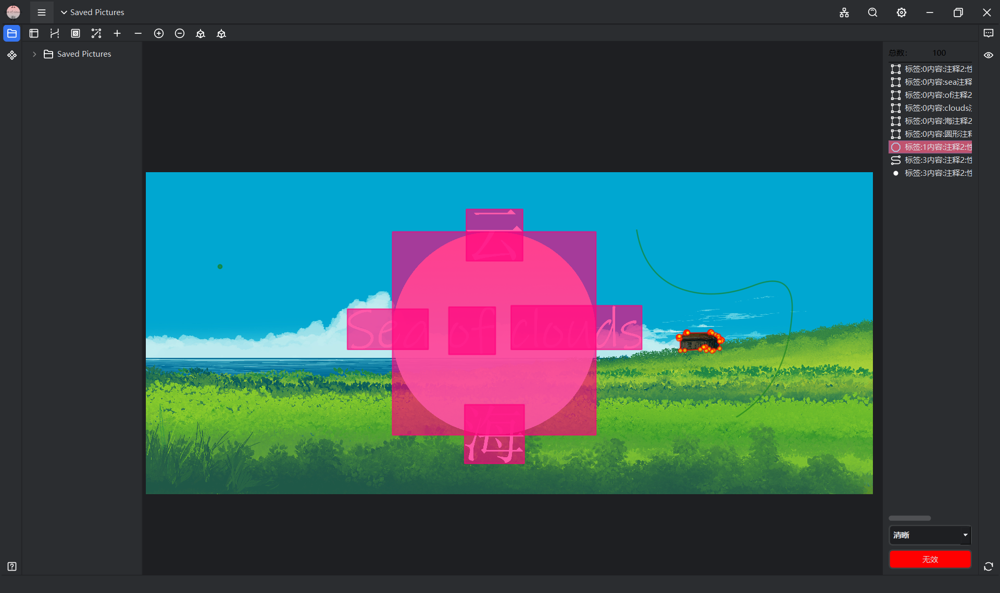

# D0 Tools

## 一、使用文档

> 其中带有`*`的为目前不可用状态
>
> 其中带有`^`的为目前可用后续优化

### 基础界面

| 序号 |    按钮    |        功能        |
| :--: | :--------: | :----------------: |
|  1   |  关闭按钮  |      关闭窗口      |
|  2   | 最大化按钮 |     最大化窗口     |
|  3   | 最小化按钮 |     最小化窗口     |
|  4   |  设置按钮  |      设置窗口      |
|  5   |  搜索按钮  |  搜索文件栏文件名  |
|  6   |  协同按钮  |     *暂未完成      |
|  7   |  最近打开  | 最近打开文件夹菜单 |
|  8   |  菜单按钮  |    弹出工具菜单    |
|  9   | 文件栏按钮 |  显示与隐藏文件栏  |
|  10  | 插件栏按钮 |  显示与隐藏插件栏  |
|  11  |  帮助按钮  |     *暂未完成      |
|  12  |  刷新按钮  |  刷新所打开的项目  |
|  13  |  信息按钮  |     *暂未完成      |

### 文件栏

| 序号 |       按钮       |               功能               |
| :--: | :--------------: | :------------------------------: |
|  1   |      文件夹      |          双击展开文件夹          |
|  2   |       文件       |          双击打开该文件          |
|  3   |   右键菜单删除   |         删除文件或文件夹         |
|  4   | 右键菜单复制路径 |   复制文件或文件夹路径到剪切板   |
|  5   |  右键菜单打开于  | 在资源管理器中打开该文件所在位置 |

### 插件栏

| 序号 |     按钮     |      功能      |
| :--: | :----------: | :------------: |
|  1   |   插件类别   | 双击展开该类别 |
|  2   |     插件     | 双击打开该插件 |
|  3   | 右键菜单打开 |   打开该插件   |
|  4   | 右键菜单删除 |   卸载该插件   |

### 预设图像标注工具

#### 可见操作

| 序号 |       按钮        |         功能         |
| :--: | :---------------: | :------------------: |
|  1   |     辅助标注      |    AI赋能数据标注    |
|  2   |      下一张       |    切换下一张图片    |
|  3   |      上一张       |    切换上一张图片    |
|  4   |     辅助标尺      | 显示隐藏标注辅助标尺 |
|  5   |     标尺样式      |   切换标尺样式按钮   |
|  6   |       填充        |  多边形内部填充颜色  |
|  7   |      显示点       |     显示标注的点     |
|  8   | 增加不透明度（q） |   增加标注不透明度   |
|  9   | 减少不透明度（w） |   减少标注不透明度   |
|  10  |   增加线宽（a）   |     增加连线宽度     |
|  11  |   减少线宽（d）   |     减少连线宽度     |
|  12  |  自适应缩放（z）  |  自适应缩放图片大小  |
|  13  |     显示文字      |   ^显示标注点文字    |
|  14  |   轮廓标注共边    |     轮廓标注共边     |
|  15  |       保存        |     保存标注数据     |
|  16  |      标注项       |    单击选中标注项    |
|  17  |       删除        |      删除标注项      |
|  18  |     上移图层      |     向上移动图层     |
|  19  |     下移图层      |     向下移动图层     |
|  20  |      工具栏       |   显示/隐藏工具栏    |
|  21  |   当前标注项数    | 仅用于显示标注项数量 |
|  22  |   整体属性选项    |   用于标注整体属性   |

#### 不可见操作

|       操作       |        功能        |
|:--------------:|:----------------:|
|       Z        |     图像自适应缩放      |
|       Q        |      增加不透明度      |
|       W        |      减少不透明度      |
|       A        |       增加线宽       |
|       D        |       减少线宽       |
|       S        |      恢复默认线宽      |
|       滚轮       |       缩放图像       |
|    Shift+滚轮    |      快速缩放图像      |
|   悬浮于轮廓+Del    |      删除标注项       |
|    悬浮于轮廓+E     |     修改标注项属性      |
|    悬浮于轮廓+拖动    |       移动轮廓       |
|   悬浮于轮廓+Alt    |        共边        |
|    悬浮于轮廓+R     |   追加涂抹区域为悬浮区域    |
|  悬浮于轮廓+Ctrl+R  |   去除涂抹区域在悬浮区域    |
|   悬浮于轮廓+R+滚轮   |     改变涂抹区域大小     |
| 悬浮于轮廓+Shift+点击 |     在轮廓内开始标注     |
|     空格+拖动      |       移动图像       |
|     Ctrl+Z     |      回退上一步       |
|  Ctrl+Shift+Z  |      回退下一步       |
|     X+点模式      |       一类点        |
|     C+点模式      |       二类点        |
|     V+点模式      |       三类点        |
|      方向键       |     微调标注项位置      |
|   Shift+方向键    |    加速微调标注项位置     |
|       N        |      增加字体大小      |
|       M        |      减小字体大小      |
|       1        |       矩形模式       |
|       2        |       轮廓模式       |
|       3        |       线模式        |
|       4        |       点模式        |
|       5        |    无模式（此时为查看）    |
|      Caps      | 锁定操作（按住时只能操作此图形） |

